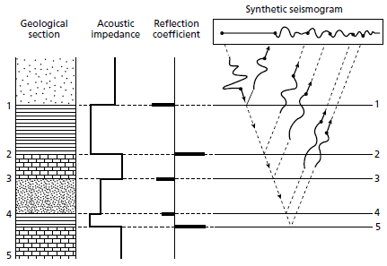
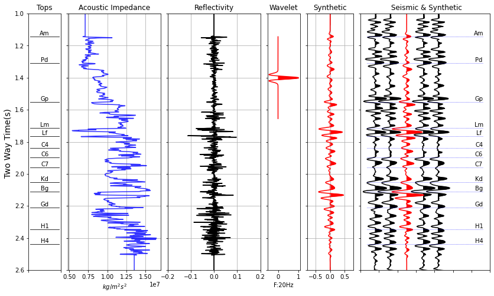

# HackaGeo Halliburton 2021 - Graduação

## :earth_americas: The HackaGeo

Hackageo is a competition sponsored by SBGF in partnership with Halliburton that takes place among students from Brazilian universities, with the objective of developing students skills through challenges involving programming and leading them to the creation of technological innovations.

The challenge is to automate a well tie process.

## :dart: Objective and major challenges

The principal objectives proposed in the **well-tie automation process** are:
* Learn how to read .las and .segy files in python;
* Aplication of different equations related to well tie;
* Convert time-based data to depth-base;
* Create different kind of wavelets to adjust with our well log;
* We don't know the P-wave speed of both the sea and the upper part of the well where there is no `DT` recording

## :page_with_curl: Well-tie theory

Well to seismic ties is one of the most fundamental steps in seismic interpretation. It relates subsurface measurements obtained at a wellbore measured in depth and seismic data measured in time. The process of well tie is comprised of, mainly, the seismic signal reconstruction from well-log measurements. A time-depth relationship is typically computed by integrating the slowness function measured at a wellbore. Mis-ties are often present and adjustments to the time-depth relationship should be done to solve it. 

The image below was taken from the book *An Introduction to Geophysical Exploration* (from Philip Kearey, Michael Brooks, and Ian Hill) and shows us four different components for the same section. From left to right, we have:

* The geological section;
* The acoustic impedance profile;
* The reflection coefficient profile;
* And after being convolved with the source wavelet, we obtain the signal the well location (shown in the upper part as a synthetic seismogram);



So, if one does have the Geological section, or the Acoustic Impedance profile, or Reflection Coefficient profile, it is possible to calculate a synthetic seismic trace corresponding to that location. **Recovering this synthetic signal that matches the measured signal is the proccess of well-tieing**.

## :computer: Technologies

Python

Run it to install the dependencies:
```bash
pip freeze -r install requirements.txt
```

## :floppy_disk: Data

Mandatory:
* A well in .las
* A seismic cube in .sgy

Optional:
* A wavelet in .csv

Set the data's paths and the parameters in data/inputs.json

## :hand: How use

Simple like that :smile:
```python
python main.py path
```
An output folder will be creat with well_name_DT.dat and well_name_synth.dat with Decision Space Geoscience format.

## :bar_chart: Methodology to choice a wavelet (if you don't set one)

## :rocket: Results




## :sunglasses: Contributors

Advisor:
* Leonardo Miquelutti

Students:
* Anderson Moraes
* Gustavo Souza
* Hugo Araújo
* Nathalia Campos
* Pedro Sousa

## :scroll: License

Definir uma licença.
